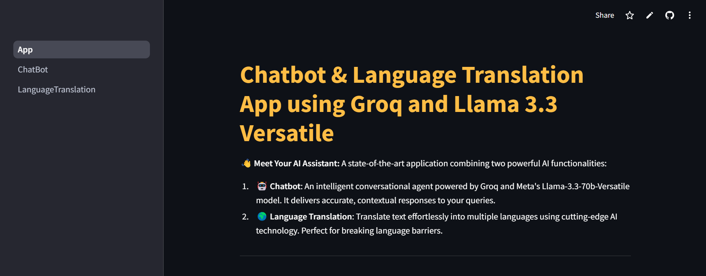
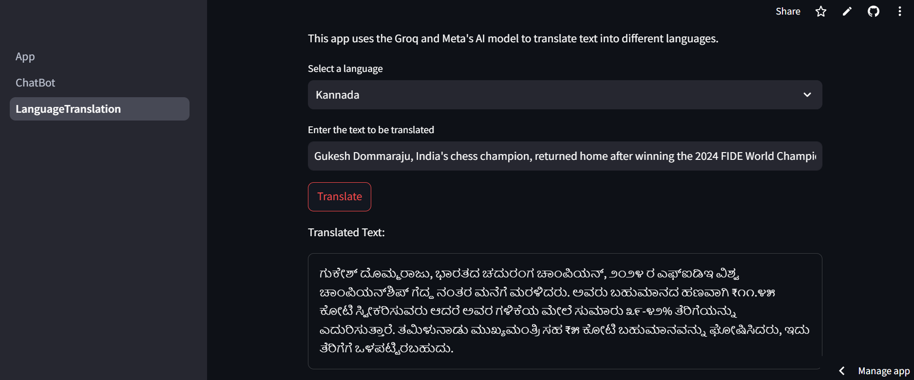
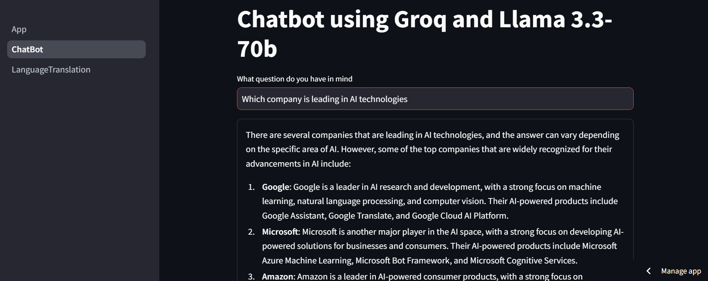

# Chatbot & Language Translation App using Groq and Llama 3.3 Versatile

## Project Overview

This project combines two powerful AI functionalities into a multipage Streamlit application:

1. **Chatbot**: An intelligent conversational agent built using Groq and Meta's Llama-3.3-70b-Versatile model, capable of answering user queries accurately and contextually.
2. **Language Translation**: A robust tool for translating text into multiple languages, leveraging the same underlying AI model for high-quality translations.

This application demonstrates how AI models can be utilized for diverse use cases in a seamless and interactive user interface. It showcases the versatility and potential of advanced large language models in providing solutions to everyday tasks. By combining chatbot and translation capabilities, this project addresses both conversational and linguistic needs, offering a practical and engaging user experience. The intuitive design ensures accessibility for users with varying technical expertise.

Whether you're seeking quick answers to queries or translating text into a preferred language, this application serves as a powerful example of integrating cutting-edge AI technology into real-world applications

```bash
📁 Project Folder
├── app.py                  # Main entry point for Streamlit
├── pages/                  # For multi-page setup
│   ├── 01_LanguageTranslation.py
│   ├── 02_ChatBot.py
├── requirements.txt        # Dependencies for the app
└── README.md
```


## Key Features

### Chatbot
- Powered by **Groq AI** and **Llama-3.3-70b-Versatile** model.
- Dynamic conversational capabilities to answer user queries effectively.
- Simple and intuitive user interface for entering questions and receiving responses.

### Language Translation
- Supports translation into multiple languages, including:
  - Hindi
  - Telugu
  - Kannada
  - Tamil
  - Malayalam
  - Marathi
  - French
  - Spanish
  - Japanese
  - Chinese (Simplified)
  
- Built with Groq's advanced language processing capabilities.
- User-friendly interface for inputting text and selecting target languages.


## Installation

### Steps

1. Clone the repository:

   ```bash
   git clone https://github.com/kiran-91/ChatBot-cum-Translation-app-using-Groq-and-Llama-3.3.git
   cd ChatBot-cum-Translation-app-using-Groq-and-Llama-3.3
   ```

2. Install the required Python packages:

   ```bash
   pip install -r requirements.txt
   ```

3. Create a `.sreamlit` folder and then create a `secrets.toml` file to securely store your API keys:

   ```env
   GROQ_API_KEY=your_groq_api_key
   ```

4. Run the Streamlit application:

   ```bash
   streamlit run App.py
   ```

## Results
If you're on Team Lazy like me and would rather skip all the tasks, no worries—just kick back and check out the Streamlit app right here!
   ```bash
   https://chatbotstranslate.streamlit.app
   ```


## Usage

### Navigating the App

The application is divided into two pages:

1. **Chatbot**:
   - Enter your question in the input field.
   - Click on the "Answer this question" button to generate a response.
   - If the input field is empty, an error message will prompt you to provide a valid query.

2. **Language Translation**:
   - Select a target language from the dropdown menu.
   - Enter the text you want to translate.
   - Click on the "Translate" button to generate the translated text.
   - If the input field is empty, an error message will prompt you to provide valid text.

3. **Check out the images here for reference**





## Contributions

Contributions are welcome! Feel free to fork the repository, create new features, fix bugs, or improve the existing functionality. Submit a pull request to have your changes reviewed.

## License

This project is licensed under the MIT License. See the LICENSE file for more details.

## Acknowledgments

- [Groq AI](https://www.groq.com/): For their powerful and efficient language model platform.
- [Streamlit](https://streamlit.io/): For the elegant and user-friendly UI framework.
- [Meta's Llama Models](https://ai.facebook.com/tools/llama): For the underlying AI technology/models.

